<div align="center">


<a href="https://git.io/typing-svg">

</a>

<br>


<a href="https://github.com/kamalgupta1518-netizen?tab=followers">

</a>

<a href="https://github.com/kamalgupta1518-netizen">

</a>

</div>

---

## 👨‍💻 About Me

I'm a **Computer Science student** who enjoys turning concepts into practical software. My current interests sit at the intersection of **Python, backend development, data, AI, and problem solving**.

I learn by building — search engines, recommendation systems, developer tools, APIs, and algorithmic solutions — and I like understanding the fundamentals behind what I use.

```python
kamal = {
    "role": "Computer Science Student",
    "focus": ["Python", "DSA", "Backend", "AI", "Data Science"],
    "mindset": "Learn → Build → Break → Fix → Repeat",
    "goal": "Become a stronger software engineer one project at a time"
}
```

---

## 🛠️ Tech Stack

<div align="center">

### Languages
<p>

</p>

### Frameworks, Libraries & Data
<p>

&nbsp;&nbsp;

&nbsp;&nbsp;

&nbsp;&nbsp;

&nbsp;&nbsp;

</p>

### Tools & Platforms
<p>

</p>

</div>

---

## 🚀 Featured Projects

<table>
<tr>
<td width="50%">

### 🔎 Mini Search Engine

A Python-based search engine featuring:

- Inverted indexing
- Boolean queries: `AND / OR / NOT`
- TF-IDF ranked search
- Phrase search with positional indexing
- Highlighted result snippets
- Incremental re-indexing

**Stack:** Python · DSA · Information Retrieval · Flask · FastAPI

</td>
<td width="50%">

### 🎬 Movie Recommender

A recommendation system that combines data processing and APIs to generate movie suggestions with poster integration.

**Stack:** Python · Pandas · Scikit-learn · TMDB API · Streamlit

</td>
</tr>
<tr>
<td width="50%">

### 🧠 CodeGraphContext

A developer-focused project exploring code context, structured workflows, and intelligent tooling for software development.

**Focus:** Developer Tools · Code Intelligence · AI

</td>
<td width="50%">

### 💡 DSA & Problem Solving

Regular practice with algorithms, data structures, searching, sorting, recursion, and competitive-programming-style problems.

**Focus:** Python · Algorithms · Problem Solving

</td>
</tr>
</table>

---

## 📊 GitHub Analytics

<div align="center">

<a href="https://github.com/kamalgupta1518-netizen">

</a>
&nbsp;&nbsp;
<a href="https://github.com/kamalgupta1518-netizen">

</a>

<br><br>

<a href="https://github.com/kamalgupta1518-netizen">

</a>

<br><br>


</div>

---

## 🎯 What I'm Working On

```text
┌─────────────────────────────────────────────────────┐
│  🧩 Data Structures & Algorithms                    │
│  ⚙️  Backend Development                            │
│  🤖 Machine Learning & Data Science                 │
│  🧠 AI-powered Applications                          │
│  🛠️  Practical Developer Tools                      │
│  📚 Software Engineering Fundamentals               │
└─────────────────────────────────────────────────────┘
```

---

## 🧠 Current Learning Loop

<div align="center">

**Learn** 📚 → **Build** 🛠️ → **Debug** 🐛 → **Improve** ⚡ → **Repeat** 🔁

</div>

> **“Build things that teach you something.”**

I don't want to simply collect technologies. I want to understand the fundamentals, build useful things, and become better at solving problems through code.

---

## 🌐 Let's Connect

<div align="center">

<a href="mailto:kamalgupta1518@gmail.com">

</a>

<a href="https://github.com/kamalgupta1518-netizen">

</a>

</div>

<br>

<div align="center">

### 💻 Thanks for visiting!


</div>
